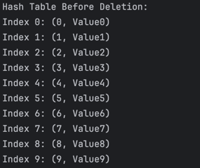
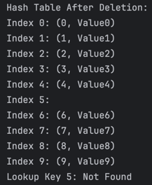

## **Task 1: Hash Table Implementation**

### **Description**
The first task implements a hash table in Java for storing key-value pairs, where the key is an integer, and the value is a string. The hash table supports basic operations such as insertion, deletion, and lookup. Collisions are handled using chaining, a technique where each bucket in the hash table is a linked list.

### **Features**
- **Key**: Integer
- **Value**: String
- **Operations**:
    - **Insertion**: Add key-value pairs to the hash table.
    - **Deletion**: Remove a key-value pair by its key.
    - **Lookup**: Retrieve the value associated with a given key.

### **Collision Handling**
Collisions are resolved using **chaining**. Each index in the hash table contains a linked list, allowing multiple key-value pairs to be stored at the same index.

### **Usage**
1. **Insert 10 key-value pairs.**
2. **Delete a key-value pair by its key.**
3. **Lookup a value by its key.**

### **Implementation Details**
- The hash function determines the index by taking the modulus of the key with the table size.
- Linked lists are used to manage collisions at the same index.

### **Screenshots**
- **Hash Table Before Deletion**: **
- **Hash Table After Deletion**: 
- **